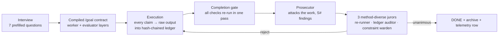

# ⚒️ Goal Forge

**An evidence-based `/goal` compiler for Claude Code — your agent can't say "done" without proving it.**

  

Autonomous agents love declaring victory. They say *"all tests pass"* without pasting the test output, *"deployed"* without a live check, *"optimized"* with no numbers. Goal Forge compiles your task into a `/goal` contract under which **finishing is a verdict, not a feeling**: every deliverable must leave raw command output in a hash-chained evidence ledger, and an adversarial tribunal — a prosecutor whose job is to attack the work, plus three jurors who re-run the checks themselves — must reach a **unanimous** verdict before the agent is allowed to stop.

## How it works



1. **Interview** — say *"write a goal"*. The compiler scans your project and asks up to 7 prefilled questions: mission, scope, must-nots, evidence level, turn budget, tribunal strictness **and models** (prosecutor: Fable/Opus; jurors: Opus/Sonnet/Haiku), and — on greenfield builds — a **tech-stack question** with per-option trade-offs ([STACKS.md](STACKS.md)).
2. **Contract** — a two-layer `/goal` block (≤4000 chars, linted against [10 criteria](LINT.md)): a worker layer (tasks with inline evidence requirements, FORBIDDEN list, safety valve) and an evaluator layer (`<condition>`, `<evidence-map>`, `<anti-accept>`).
3. **Ledger** — during execution, every load-bearing output is appended to a tamper-evident sha256 chain via [`scripts/ledger.sh`](scripts/ledger.sh) (`append` / `verify` / `measure`). In-place edits break the chain mechanically.
4. **Tribunal** — on a done-claim: completion gate → prosecutor (numbered findings, each must be closed with evidence) → three jurors diversified by *verification method*, with tool access. Rejection comes with a deficiency list; three consecutive rejections hand the goal back to you as BLOCKED. Deadlock is impossible; so is rubber-stamping.

## A compiled contract, at a glance

```text
/goal [GF·goal·budget:20·jury:heavy·ledger:goals/EVIDENCE.md·label=D#]
DONE-MEANS (summary): every D# raw-evidenced + unanimous jury verdict.
═══ WORKER LAYER ═══
MISSION: The pricing page ships to production with live verification.
TASKS:
□ D1 Create/update PLAN.md — evidence: file + trace.
□ D2 Implement tier table — evidence: git diff stats + route returns 200.
□ D3 Deploy + live check — evidence: raw curl status + content grep.
FORBIDDEN: no schema changes · no touching checkout flow.
...
═══ EVALUATOR LAYER ═══
<anti-accept>NOT met if: "done" with no raw output · summary instead of
raw block · no unanimous verdict · a D# never mentioned ...</anti-accept>
```

## Install

```bash
git clone https://github.com/eccj/goal-forge ~/.claude/skills/goal-forge
```

Then in any Claude Code session: just say **"write a goal"** (or `/goal-forge`). Requires Claude Code ≥ 2.1.139 (`/goal` support). Zero dependencies beyond bash + shasum. Full walkthrough: [QUICKSTART.md](QUICKSTART.md).

## FAQ

**Why a jury instead of one checker?** Panels of identical checkers collapse into one opinion. The three jurors differ by *method* — one re-runs commands, one recomputes the hash chain against real files, one audits constraints and Goodhart gaming ("metric passed AND intent satisfied"). In our development runs, juror rejections repeatedly caught real defects the worker had missed — including fabricated evidence planted as a red-team test (development-run claim — caveats in [TRACK-RECORD.md](TRACK-RECORD.md)).

**Isn't this expensive?** Heavy mode (prosecutor + 3 jurors) is for work you'd hate to redo. Small tasks (≤3 deliverables, ≤15 turns) compile to **light mode**: one tool-equipped auditor covering all three methods. Evidence and ledger rules are never lightened — only the headcount.

**What's the tech-stack question?** On greenfield builds the interview asks which stack to use (e.g. animated site → Three.js/GSAP/CSS trade-offs; game → Unity+MCP/Godot/web). The map is a seed, not a whitelist — off-map domains get composed candidates, honestly labeled. Answer *"let research decide"* and the contract gains a research deliverable comparing candidates with live sources.

**What does the ledger actually guarantee?** Tamper-*evidence*, not cryptographic authentication: in-place edits of past entries break the chain mechanically. A from-scratch re-forge would pass the hash check — which is exactly why jurors re-run commands against reality instead of trusting the file. This limit is by design and documented in the script header.

**Can the jury be wrong?** Yes — and the protocol expects it. A juror confronted with irrefutable new evidence must revise (reopen clause); the prosecutor also attacks *shutdown* decisions, so both false-DONE and false-STOP get adversarial review. See [TRACK-RECORD.md](TRACK-RECORD.md) for how this played out in development.

## Why not …?

The model that does the work is never the model that declares it finished — in the spirit of [Loop Engineering](https://addyosmani.com/blog/loop-engineering/). As Boris Cherny (creator of Claude Code) put it: *"I don't prompt Claude anymore. I have loops running that prompt Claude and figuring out what to do. My job is to write loops."* Goal Forge is that loop's contract department.

| | goal-forge | claude-goal (native) | council-review / review panels | ralph-style loop wrappers | promptfoo / DeepEval |
|---|---|---|---|---|---|
| Interviews you, compiles the prompt | **✓** | ✗ | ✗ | ✗ | ✗ |
| Evidence Ledger (raw blocks, hash chain) | **✓** | ✗ | ✗ | ✗ (git history as state) | ✗ |
| Quality score /100 + char-budget engineering | **✓** | ✗ | ✗ | ✗ | ✗ |
| Completion-condition jury (not code review) | **✓** | audit prompt | code-review jury | exit-gate heuristics | eval framework |
| Campaign chains + engineered /loop recipes | **✓** | ✗ | ✗ | brute-force restart loop | ✗ |
| Living guardrails file (lessons applied at compile) | **✓** | ✗ | ✗ | ✓ (pioneered it) | ✗ |

## Repository map

| File | Role |
|---|---|
| [SKILL.md](SKILL.md) | the compiler pipeline (this is the skill) |
| [QUICKSTART.md](QUICKSTART.md) | 5-minute onboarding |
| [TEMPLATE.md](TEMPLATE.md) | contract skeleton · ledger & juror rules · archive format |
| [LINT.md](LINT.md) | 10 quality criteria every compile is scored against |
| [RECIPES.md](RECIPES.md) | evidence recipes per deliverable type |
| [STACKS.md](STACKS.md) | tech-stack question: firing rule + seed option map |
| [CAMPAIGN.md](CAMPAIGN.md) | multi-goal chains, sufficiency gate + appeal law |
| [TRACK-RECORD.md](TRACK-RECORD.md) | development history in numbers (with honest caveats) |
| [scripts/ledger.sh](scripts/ledger.sh) | append / verify / measure — the evidence chain |
| [examples/](examples/) | annotated case studies |

**Language policy:** repo docs are English; the trigger works in any language. Compiled contracts follow the *operator's* language (headings translate; `D#`/`E-D#`/`S#` labels, the metadata line and XML slot names never do) — jurors are instructed to judge content language-independently.

## License

[MIT](LICENSE) — build on it, break it, tell us what the prosecutor missed.
